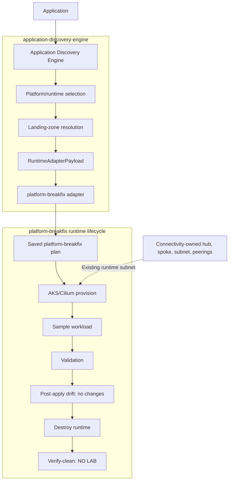

# Discovery-to-Runtime Landing Zone POC

## Status and Objective

**POC COMPLETE**

Prove application discovery, platform/runtime selection, approved landing-zone
binding, adapter translation, ephemeral AKS/Cilium execution, workload
validation, and runtime removal without runtime ownership of connectivity.

This is the owner's supplied evidence of a manually coordinated successful
slice. This documentation change did not rerun the deployment or independently
inspect other repositories. Execution date and raw log locations were not
supplied; commits and digest are traceability references, not stored artifacts.

## Repositories and Ownership

| Repository | Boundary |
| --- | --- |
| `azure-platform-architecture` | Architecture, contracts, diagrams, milestones, and evidence only. |
| `application-discovery-engine` | Application intent, platform/runtime selection, landing-zone binding, `RuntimeAdapterPayload`, and platform-breakfix adapter translation. |
| `platform-breakfix` | Runtime plan, saved-plan execution, AKS/Cilium resources, validation, destroy, and verify-clean; consumes existing networks without owning their lifecycle. |
| `azure-platform-connectivity` | Owns hub VNet, NonProd spoke VNet, runtime subnet, and hub/spoke peerings. |
| `cluster-foundation` | Remains provider-neutral; its execution was not established by the supplied evidence. |

Applications do not own connectivity. Runtime subnet-scoped RBAC does not
transfer subnet ownership. These integration participants complement the
platform model in [ADR 0002](../adr/0002-repository-separation.md).

### Implementation References

| Repository | Commit | Description |
| --- | --- | --- |
| `application-discovery-engine` | `baf71691dfb2cd7957337fd0c260b5ff01cc391d` | `feat: add offline landing-zone runtime binding` |
| `application-discovery-engine` | `24b6d6de131eef9e16cc5bbff75bbd8afb513afb` | `feat: add platform-breakfix dry-run adapter` |
| `platform-breakfix` | `41f730e9ac415aacf006f28a8225094aaf75e547` | `feat: complete external subnet AKS integration` |

## Proven Flow

Arrows show manual coordination, not an automated orchestrator. The dotted
edge consumes existing connectivity; it does not create it.



## Exact Approved Target

These identifiers are recorded at the owner's explicit request as historical
evidence and a catalog contract, not executable environment configuration or
application intent. General restrictions on deployment configuration and
artifacts in this repository remain in force.

| Field | Proven value |
| --- | --- |
| Environment / cloud | `nonprod` / `azure` |
| Subscription | `96b5adf1-55d9-4411-ae2a-adfaccecf80e` (display name `NonProd`) |
| Region | `centralus` |
| Runtime / profile | `AKS` / `cilium` |
| Lifecycle intent | `persistence = ephemeral`, `ttl_hours = 4` |

Connectivity-owned runtime subnet:

```text
/subscriptions/96b5adf1-55d9-4411-ae2a-adfaccecf80e/resourceGroups/rg-connectivity-spoke-nonprod-centralus/providers/Microsoft.Network/virtualNetworks/vnet-connectivity-spoke-nonprod-centralus/subnets/snet-runtime-nonprod-centralus
```

TTL enforcement was **not implemented**. The application contract did **not**
populate platform-breakfix `LabTtlHours`. Explicit teardown is not TTL cleanup.

## Evidence

### Plan and Provision

Plan: **5 add, 0 change, 0 destroy**. Resources:

- `azurerm_kubernetes_cluster.lab`
- `azurerm_resource_group.lab`
- `azurerm_role_assignment.aks_subnet_network_contributor`
- `azurerm_user_assigned_identity.aks`
- `time_static.lab`

No VNet resource. No subnet resource. Saved-plan continuity was proven using
SHA-256:

```text
F833EC97A796678A77DA62C778BB26E7E74FBAAA03E4249DDBC420EED9BD144E
```

Provision: **5 added, 0 changed, 0 destroyed**.

### Runtime Validation

| Check | Observed result |
| --- | --- |
| Cluster | `platform-breakfix-aks`, `NonProd`, `centralus` |
| Kubernetes / node | `1.35.7`; one Ready `Standard_D2as_v7` node |
| Networking | Azure CNI Overlay; Cilium data plane/policy |
| Pod / service CIDR | `10.244.0.0/16` / `10.2.0.0/16` |
| DNS service IP | `10.2.0.10` |
| Load balancer / API | Standard Load Balancer; public API |
| Subnet | Exact external subnet above |
| Identity / RBAC | User-assigned control-plane identity; Network Contributor scoped to exact external subnet |
| Cilium | PASS: healthy; default-deny blocked traffic; explicit allow restored traffic |

### Application Validation

Sample source: `tests/fixtures/container-runtime`. Live namespace: `poc-app`;
deployment image: `nginx:1.27.5-alpine`; Service: `ClusterIP`.

- Pod Ready and service endpoint Ready.
- Kubernetes DNS PASS: `nginx.poc-app.svc.cluster.local` resolved successfully.
- In-cluster HTTP PASS: returned `Welcome to nginx!`.

No ingress, public application IP, persistent storage, database, external DNS,
or additional Azure application infrastructure. Public AKS API access is
distinct from public application exposure.

### Drift and Ownership

Post-deployment platform-breakfix plan: **0 add, 0 change, 0 destroy**.
During live validation the external subnet, spoke VNet, and hub VNet existed;
peerings remained `Connected`. No connectivity-owned resource was managed by
platform-breakfix state. External VNet/subnet lifecycle remained with connectivity.

### Teardown

Destroy completed successfully. Verify-clean returned:

```text
PASS: Resource group 'rg-platform-breakfix-aks' is absent.
PASS: Resource group 'rg-platform-breakfix-aks-nodes' is absent.
PASS: No tagged AKS lab resources remain.
AKS PAYG lab status: NO LAB
```

## Conclusion and Limitations

An application was discovered, translated, bound to an approved landing zone,
provisioned on ephemeral AKS/Cilium using a connectivity-owned subnet,
successfully run, and its runtime removed without platform-breakfix owning
the landing-zone network.

The POC explicitly did **not** prove:

- Automated TTL enforcement or application-to-`LabTtlHours` propagation.
- Production approval workflow or Seneschal authorization.
- Generalized landing-zone catalog or multiple landing zones.
- Multiple Azure regions or alternate runtime implementations.
- Private AKS API, Azure Firewall, or Private DNS Resolver.
- Production network security controls or remote-state hardening.
- CI/CD automation or unattended production execution.

Service DNS success does not establish external/platform DNS integration.
This slice does not close broader M7-M10 outcomes or establish production
readiness. Next: [M8.1 - Repeatable Runtime Orchestration](../roadmap/09-application-landing-zones.md).
