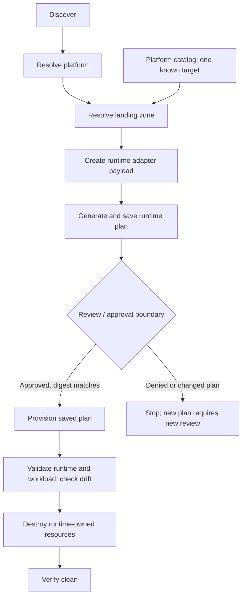

# M8 - Application Landing Zones

## Status

Discovery-to-Runtime Landing Zone **POC COMPLETE**; see the
[closure and evidence](../architecture/discovery-to-runtime-poc.md).

Next: **M8.1 - Repeatable Runtime Orchestration** (defined, not implemented).
This is a narrow increment within M8, not completion of the broader enterprise
landing-zone milestone. Other platform milestones are not closed by this POC.

## M8.1 Objective

Turn the manually coordinated successful vertical slice into one repeatable,
controlled workflow without replacing the existing engines.

## Scope and Ownership

- `application-discovery-engine` retains application intent, platform selection,
  landing-zone/runtime binding, and adapter payload generation.
- `platform-breakfix` retains AKS runtime planning and execution.
- `azure-platform-connectivity` retains VNet, subnet, and peering ownership.
- `cluster-foundation` remains provider-neutral.
- This repository defines architecture, contracts, diagrams, and acceptance
  criteria only. Implementation belongs in the existing engines.

No duplicate AKS or Terraform implementation, new runtime engine, or direct
application ownership of connectivity is permitted. The workflow entry point
and catalog file format are implementation choices to document in the consuming
repository; no existing CLI or payload fields are invented here.

## Controlled Lifecycle



Approval may initially be local/manual and must identify the resolved target,
plan summary, and saved-plan SHA-256. Provision must verify the digest and use
that same saved plan. Missing approval, target mismatch, or changed plan must
block provision; re-planning requires new review. This is not a production
approval system or Seneschal authorization.

Validation and verify-clean are first-class stages with recorded results.
Validate Cilium health and deny/allow behavior, workload readiness, service
DNS/HTTP, and zero-change post-apply drift. Failure remains visible even if
cleanup succeeds. Partial provision or failed validation must leave an explicit
runtime-only cleanup path; cleanup must not rely on TTL expiration.

Destroy operates through platform-breakfix against the identified run's
runtime-owned resources only. It must not import, delete, or change
connectivity-owned VNet/subnet/peerings. Verify-clean records both runtime
resource groups absent and no tagged AKS lab resources. Also record retained
connectivity resources and Connected peerings after cleanup. These are future
requirements, not claims of additional historical teardown checks.

## Initial Landing Zone Catalog Contract

The catalog is **platform configuration, not embedded application intent**.
It supplies approved binding data to discovery's resolver. Applications describe
requirements without carrying subscription or subnet IDs. Executable catalog
configuration belongs with platform-controlled configuration consumed by the
existing resolver, not in this architecture repository. No catalog service or
generalized provisioning system is required.

The initial catalog must contain exactly one known target:

| Logical field | Initial contract value |
| --- | --- |
| Lookup tuple | `nonprod / azure / centralus / aks / cilium` |
| Subscription | `96b5adf1-55d9-4411-ae2a-adfaccecf80e` |
| Runtime subnet | Exact resource ID below |
| Network owner | `azure-platform-connectivity` |
| Runtime executor | `platform-breakfix` |

```text
/subscriptions/96b5adf1-55d9-4411-ae2a-adfaccecf80e/resourceGroups/rg-connectivity-spoke-nonprod-centralus/providers/Microsoft.Network/virtualNetworks/vnet-connectivity-spoke-nonprod-centralus/subnets/snet-runtime-nonprod-centralus
```

These values document the owner-approved mapping, not a deployable catalog or
a general exception to repository guardrails.

Required contract behavior:

1. Resolve the complete environment/cloud/region/runtime/profile tuple against
   platform configuration. Unsupported or missing matches fail before planning;
   no fallback to another subscription, region, runtime, or subnet.
2. Return the selected subscription and exact external subnet to runtime
   binding. Reject incomplete, conflicting, or ambiguous configuration.
3. Preserve binding through `RuntimeAdapterPayload`, adapter translation, saved
   plan, review, and execution. Application intent cannot override platform IDs.
4. Capture the tuple and mapping with run evidence for plan review; changed
   binding requires a new plan and review. Serialization and storage format
   remain implementation details of existing resolver/adapter contracts.
5. Preserve `persistence = ephemeral` and `ttl_hours = 4` as intent only. Do not
   promise TTL enforcement or claim application population of `LabTtlHours`.

## Non-Goals

No automatic TTL enforcement, Seneschal dependency, production approval system,
CI/CD automation, unattended production execution, generalized landing-zone
catalog, multiple targets or regions, alternate runtime, private AKS API,
firewall, DNS resolver, production network security controls, remote-state
hardening, production hardening, or generalized subscription vending.

The public API and in-cluster sample workload remain the proven baseline. No
ingress, public application IP, storage, database, external DNS, or additional
Azure application infrastructure is introduced by this milestone.

## Acceptance Criteria

- [ ] One documented workflow coordinates discover, platform resolution,
  landing-zone resolution, payload, plan, approval, provision, validation,
  destroy, and verify-clean through existing engines.
- [ ] The platform-owned catalog has exactly the mapping above; unsupported
  tuples, conflicting mappings, and application infrastructure-ID overrides
  are rejected before runtime planning.
- [ ] Binding is traceable through payload, adapter, plan, and execution, with
  no duplicate AKS/Terraform implementation or new runtime engine.
- [ ] Approval records target, plan summary, and SHA-256. Denial, missing
  approval, and digest/target mismatch block provision; re-planning invalidates
  prior approval.
- [ ] The plan consumes the exact external subnet and manages no VNet, subnet,
  or peering; provision uses the approved saved plan.
- [ ] Validation records Ready status, Cilium health and deny/allow results,
  service DNS/HTTP success, and 0 add, 0 change, 0 destroy post-apply drift.
- [ ] Partial/failed execution exposes runtime-only cleanup and records failure;
  success and clean state are never reported without evidence.
- [ ] Destroy/verify-clean record both runtime resource groups absent, no
  tagged lab resources, and `NO LAB`; connectivity remains present with
  Connected peerings and outside runtime state ownership.
- [ ] Two consecutive approved runs from a clean runtime baseline complete
  against the same catalog target without engine code edits between runs.
  Each records its own digest, approval, stage results, and cleanup evidence
  in the implementation workflow's evidence location.
- [ ] Documentation states TTL remains unenforced, `LabTtlHours` is not
  populated by the application contract, and no excluded capability is claimed.

## Accomplished Looks Like

Another engineer can repeat the slice through one documented workflow, review
the exact saved plan, see validation results, and remove only runtime resources
with explicit clean-state evidence. See the
[implementation backlog](../../backlog/milestone-08-landing-zones.md).
